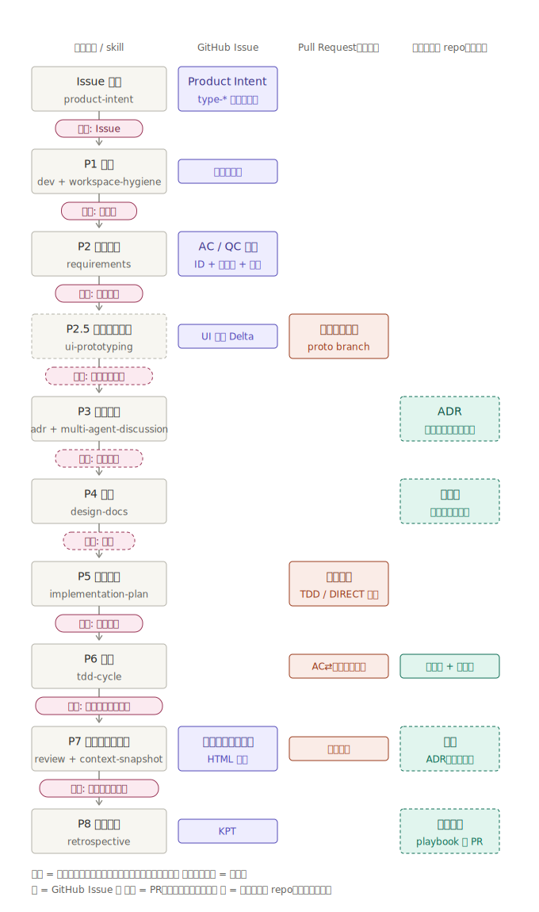

# aidd テンプレート

AI 駆動開発（AIDD）向けの汎用 playbook テンプレート。

## 概要

### このプロジェクトのゴール

AI 駆動開発を **安全に・継続的に改善しながら回す** ための共通運用ルールと skill を提供する。狙いは次の 2 つを両立させること。

- **意図（Intent）を失わない**: 「なぜ作るのか」「何を満たせば正しいのか」「なぜその判断をしたのか」を、各工程の成果物に小さく記録し、後から辿れるようにする。AI 駆動開発で蓄積しやすい認知負債を抑える
- **プロセスを重くしない**: 詳細仕様を大量に書かせるのではなく、**受入れ・品質基準の定義と各ゲートでの検証** で品質を担保する。ドキュメントは「書くべき判断が生じたときだけ」書く（判断駆動）

開発はチケットから始まり、チケットの**タイプ**（feature / bugfix / hotfix / refactoring / chore / spike）に応じて通るフェーズが決まる。各フェーズには人間の承認ゲートがあり、最終決定は常に人間が行う。

詳細な設計は [開発フェーズとコンテキスト契約](docs/design/0001-dev-phase-decomposition.md) を参照。

### 開発フローの全体像



- 縦の流れがフェーズ、ピンクの楕円が承認ゲート。横の列は成果物（コンテキスト）の行き先を表す
- 破線の成果物・ゲートは条件付き: ADR・設計書は書くべき判断が生じたときだけ作り（判断駆動）、プロトタイピングは UI 変更時のみ実施する
- コンテキストは 2 層: **短期**（Jira コメント・PR、マージ後は使い捨て）と **長期**（プロダクト repo の ADR・設計書・テスト、イミュータブル）。マージ前に「短期コンテキストの昇格」で長期価値あるものだけを残す
- タイプ別にどのフェーズを通るかは [人間向けマニュアル](docs/manual.md#タイプ別ルート) を参照

## 導入

このリポジトリを clone し、各プロジェクトから絶対パスで参照する形で導入する。更新は clone 側で `git pull` する（版管理の方針は将来見直し予定）。

### Claude Code

1. プロジェクトの `.claude/commands/` に、このリポジトリの wrapper を参照する command を置く
2. プロジェクトの `CLAUDE.md` に共通ルールへの参照と Project Configuration を追加する

```md
@/path/to/aidd/shared/rules/common.md

## Project Configuration
- Test command: `npm test`
- Build command: `npm run build`
- Lint command: `npm run lint`
```

### Codex

プロジェクトの `AGENTS.md` に共通ルールを参照させ、必要に応じて `.agents/skills/` を repo に配置する。

```md
@/path/to/aidd/shared/rules/common.md
```

## 使い方

```
# 1. チケットを作る（タイプを確定）
> /product-intent 検索画面の表示崩れを直したい

# 2. 着手する（タイプからルートが決まる）
> /dev ECS-12345
```

以降は各フェーズ skill が順に呼ばれ、節目で人間の承認を求める。

- はじめての方: [チュートリアル](docs/tutorial.md)（最短の流れ）
- 各フェーズで人間が何を判断するか: [人間向けマニュアル](docs/manual.md)

## 構成

| 場所 | 役割 |
|---|---|
| `.agents/skills/` | skill 本文の source of truth |
| `.claude/commands/` | Claude Code から呼ぶ薄い wrapper |
| `shared/rules/` | 共通ルール |
| `shared/templates/` | 汎用テンプレート |
| `docs/` | ADR、設計、チュートリアル、マニュアル、調査メモ |

## Skills

### 開発プロセス（フェーズ）の skill

チケット作成から振り返りまでの開発プロセスを構成する skill。フェーズ順。

| skill | フェーズ | 概要 |
|---|---|---|
| `product-intent` | 入口 | 要求をタイプ付きの Jira チケットへ整える（`type-*` ラベル必須） |
| `dev` | P1 着手 | `type-*` ラベルからルートを特定し、各フェーズ skill へ振り分ける |
| `requirements` | P2 要求整理 | 受入れ条件・品質条件を ID・信頼性マーカー・検証手段タグ付きで確定する |
| `ui-prototyping` | P2.5 | UI の試作と PdM とのすり合わせ、実装ハンドオフ文書の生成（UI 変更時のみ） |
| `adr` | P3 技術判断 | 技術判断を ADR としてイミュータブルに記録する（判断駆動） |
| `design-docs` | P4 設計 | 責務分割・守るべき振る舞いを設計書に残す（判断駆動） |
| `implementation-plan` | P5 実装計画 | 実装順序と TDD / DIRECT 区分を計画し draft PR に残す |
| `tdd-cycle` | P6 実装 | TDD サイクルで実装し、テストを AC-ID に対応付ける |
| `review` | P7 検証・レビュー | ブランチレビュー、受入れ検証、短期コンテキストの昇格判定 |
| `context-snapshot` | P7 | チケットの意図と検証状態を HTML スナップショットに生成する |
| `retrospective` | P8 振り返り | KPT 形式で振り返り、playbook 改善へつなげる |
| `multi-agent-discussion` | P3 補助 | 複数の独立視点で調査し、アンカリングを避けて選択肢を整理する |

### 開発プロセス外の skill

| skill | 概要 |
|---|---|
| `workspace-hygiene` | 作業開始前の差分整理と topic branch 作成（P1 で利用） |
| `ui-migration` | UI フレームワーク移行のルール抽出、変換、検証を管理する |
| `daily-sentry-check` | wbb の日次 Sentry 監視を集計し、シート更新案と Slack 投稿文をまとめる |

## 設計メモ

- 開発フェーズとコンテキスト契約: [docs/design/0001-dev-phase-decomposition.md](docs/design/0001-dev-phase-decomposition.md)
- Intent Driven Development: [docs/design/intent-driven-development.md](docs/design/intent-driven-development.md)
- ADR: [docs/adr/0001-restructure-skills-for-codex-and-claude.md](docs/adr/0001-restructure-skills-for-codex-and-claude.md)
- skill 再編の設計: [docs/design/skills-restructure.md](docs/design/skills-restructure.md)
- UI Prototyping: [docs/ui-prototyping-guide.md](docs/ui-prototyping-guide.md)

## 追加・修正ルール

- skill は `.agents/skills/` に追加する（source of truth）
- Claude Code の command は `.claude/commands/` に薄い wrapper として追加する
- 共通ルールは `shared/rules/` に追加する
- playbook 自体の改善は、各プロジェクトの振り返り（P8）からこのリポジトリへの PR として還流する
